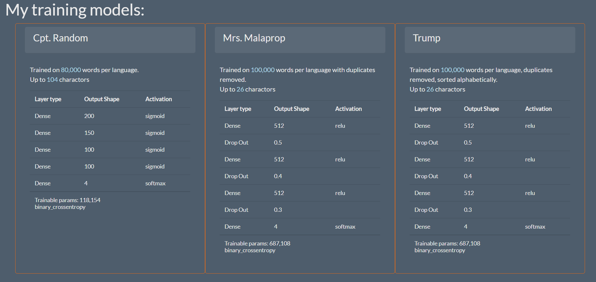

# Language Identification

Final-Project - Machine-Learning

Team members: Adam Forest Newlyn, Allison Bolger, Arunima Menon, Cristina Iacob

Data link: https://drive.google.com/drive/folders/1eELkoQka39Z0Qd-4mv_Z_cqxUROURzoU?usp=sharing

Getting Started

1. Load requirements.txt
2. Open Jupyter notebook and run the language_detect_train.ipyng
3. In web folder, run $python app.py 
4. Open browser to http://localhost:5000/

